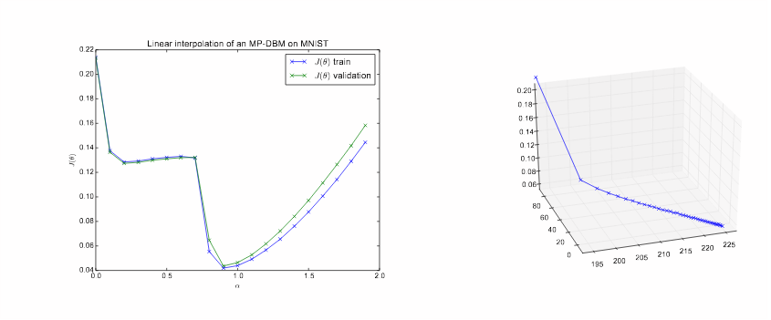

# MLRG Notes

Note taking during UBC [Machine Learning reading group]([http://www.cs.ubc.ca/labs/lci/mlrg/](http://www.cs.ubc.ca/labs/lci/mlrg/)) and extensions to knowledge. 

## Week 1 :Generalization of Neural Networks

## Week 2 : Sharp Minima Generalize Poorly

**Key Points :** 

- Large Batch (LB ) Training lead to sharp minima and Small Batch (SB) training leads to large minima
- Define what is a Large Minima / Sharp Minima and how to measure sharpness ( 2 ways )
- Sharp Minima are generalizing less good than large minima
- Techniques like data augmentation can improve generalization without influencing sharpness. 

> The lack of generalization ability is due to the fact that large-batch methods tend to convergetosharp minimizersof the training function.  These minimizers are characterized by a signif-icant  number  of  large  positive  eigenvalues  in∇2f(x),  and  tend  to  generalize  less  well.   Incontrast, small-batch methods converge toflat minimizerscharacterized by having numeroussmall eigenvalues of∇2f(x). We have observed that the loss function landscape of deep neuralnetworks is such that large-batch methods are attracted to regions with sharp minimizers andthat, unlike small-batch methods, are unable to escape basins of attraction of these minimizers.

**Notes :** 

This talk rely essentially on paper [1] that study the influence of the size of the Batch both on the Generalization and the "Sharpness" of the mini ma in the case of Stochastic Gradient Descent ( SGD ).

<u>Stochastic Gradient Descent :</u> 

Gradient descent is an iterative method for optimizing objective differentiable function. In the classic version we use the actual gradient of the dataset ( The error for the all dataset is computed ). The stochastic version use an estimate calculated on a random part of the dataset ( the concept of a batch).

$$
x_{k+1}=x_{k}-\alpha_{k}\left(\frac{1}{\left|B_{k}\right|} \sum_{i \in B_{k}} \nabla f_{i}\left(x_{k}\right)\right)
$$

Where $B_k$ is the batch.

The stochastic gradient descent guarantees : 

- (a) convergence to minimizers of strongly-convex functions and to stationary points ( local optima ) for non-convex functions (Bottou et al., 2016)
-  (b) saddle-pointavoidance (Ge et al., 2015; Lee et al., 2016)
- (c) robustness to input data (Hardt et al., 2015).

<u>Size of the Batch :</u> 

RuntimeError: Expected object of backend CUDA but got backend CPU for argument #2 'mat2'The size of the Batch is a parameter we can choose we using SGD, it can speed up the computation but it pratice some experiments showed that augmenting to much the size o the batch could lead to a loss in accuracy. 

<u>Sharpness of the Minima :</u>

The sharpness of the minima is defined by Hochreiter & Schmidhuber in 1997.  A Flat minimizer is one where we can modify the parameters ( here in x ) in a relatively large neighborhood without the loss function to increase to much and a sharp one is the opposite basically. 

 

An interesting thing is that we can measure the Sharpness of a minimizer by the magnitude for the eigenvalues of $\nabla^{2} f(x)$ . 

**Classic Technique to measure the Sharpness :**

Reminder : The first derivative of a function indicate how that function change if we change the input ( if I node a bit x what will happen with f(x) ) and the second derivative is the derivative of this derivative that indicate how this variation change with x ( like the acceleration of a vehicle is the second derivative of a movement ). So if the second derivative is positive then the first derivative is increasing when x is increasing, the function is *concave up* if the second derivative is negative the function is concave down. Also the higher is the absolute value of a the second derivative is the faster the function is increasing creating a sharper spike. Here we have a function $R^n\rightarrow R$ so we cannot directly take the directly the derivative. We use the Hessian matrix, then we can take the eigenvalues of the Hessian to interpolate the explanation we done for second degree derivative. If the Hessian is positive definite (eigenvalues all positive ) at a point x  ( here the parameters ) then we are at a local minimum, if it is negative definite we are at a local maximum and if it is a mix we are at a saddle point. We can use the magnitudes of the eigenvalues to have the sharpness of the minima for each of it's input dimension. [Notebook](notebooks/Find_Eigenvalues.py)

[4] Use that metric ---> ==DESCRIBE==

-> Publication that use that metric

**Their Technique :** 

Apparently computing the eigenvalues of the Hessian is to expensive when we have a lot of parameters so they use another technique to compute sharpness. Their technique modify slightly the parameters in the neighborhood of the minima and check the maximum loss they can reach if they reach a big loss it is likely that the loss function was globally increasing around.  Because this metrics is using max it is sensible to a outliers in the loss function ( if we have a spike ) they do maximization on random manifold.

The sharpness of the function f at point x is defined as : 

<u>Visualizing the loss-parameters space :</u>

Now we have a definition and a metrics for sharp minima it is natural to be interested in visualizing the loss evolution in the parameter space. [2] introduce a technique to visualize in one dimension the evolution of the loss depending on the variation of the parameters. In order to do that they evaluate $J(\theta)$ for a series of points $\theta = (1-\alpha)\theta_0+\alpha\theta_1$, this allow to draw a line in the parameter space between $\theta_0$ and $\theta_1$. In this paper they used it using $\theta_0$ as the original parameters and $\theta_1$ as the final optimized one with a lower loss. 

On this figure we see the loss associated with this "straight line" in the parameter space. At $\alpha = 0$ it is the original parameters and at $\alpha =1$ the optimized one. We can see that the parameters behave well because the closer we get in the parameter space the smaller the loss and when we get far again the loss is increasing. This can of technique can allow us to evaluate the "cost of the path" between 2 set of parameters and understand why the optimizer went that way or another way to minimize the loss. Also it can help us to compare 2 set of parameters and understand if they belong to the same minima. It can also help us to understand why a network took time to converge. 

This graph for example show us that for this given network  there is a flat area in loss improvement between the initial an optimal parameters in the parameter space, on the right it show the evolution of the loss depending of the epoch number during training and we can see that the optimizer sucessfuly avoided this plateau area and finished at the global optimum, showing that he didn't took a straight line. It also show similar results for train and test error and so no sign of overfit. 

This is an illustration on how we can compare the landscape between 2 optimal parameters of the model, here $\theta_0$ is the first optimal solution and $\theta_1$ is the second one, we can see that even if they are equivalent in loss the line between those 2 local optima encounter an higher barrier cost. It is super important to understand this graph because they are used a lot in the studied paper to observe the "Shape" of the minima founded and the difference between local minima.

So now, If we focus more on our original paper, they use this representation to study the difference between 2 local minima, one trained with large batch size in $\theta_l$ and one with small batch size in $\theta_s$ . 
$$
\text{We plot : }f(\alpha\theta_l+(1-\alpha)\theta_s)
$$
So when $\alpha=0$ we have optimal parameters with small batch and $\alpha=1$ we have optimal parameters with large batch.

We can first see on this graph that the 2 minima are not linked by a straight line ( like a valley ) because the loss is increasing when we explore the linear space between them. Also we can observer the shape of the minima. They done that for several types of networks. 

Another thing we have to take in account is that the Sharpness can be evaluated for each dimension of the parameter space individually so a minima can be sharp for one parameters and flat for another, one way to visualize that is in the previous notebook. They demonstrate that by taking different random sampling in their evaluation. 

<u>Main differences between results using LB and using SB :</u> 

Using their sharpness metric and the accuracy of the network, it is now possible to manually test ==the impact of the sharpness of generalization and the impact of the batch size on both.== 

We can see here on this 2 networks that globally increasing the batch size increase the sharpness of the minima founded and the hurt generalization ( decreasing of the testing accuracy ). 

They also present techniques where we increase gradually the batch size with the training and that seems to work. 

Apparently **Data Augmentation**, **Conservative Training** and **Robust Training** are techniques that help to improve performances with large batch and reduce the sharpness of the peaks. 

Apart from this paper, it is important to note that other experimentation show that having large batch size can also be an advantage in the case we have a noisy labeling or outliers within the dataset. I also personally observed that on practical examples with noisy datasets. 

[[1](https://arxiv.org/abs/1609.04836)] On Large-Batch Training for Deep Learning: Generalization Gap and Sharp Minima

[[2](https://arxiv.org/abs/1412.6544)] Qualitatively characterizing neural network optimization problems

[[3](https://arxiv.org/abs/1705.10694)] Deep Learning is Robust to Massive Label Noise

[[4](https://arxiv.org/abs/1802.08241)] Hessian-based Analysis of Large Batch Training and Robustness to Adversaries

